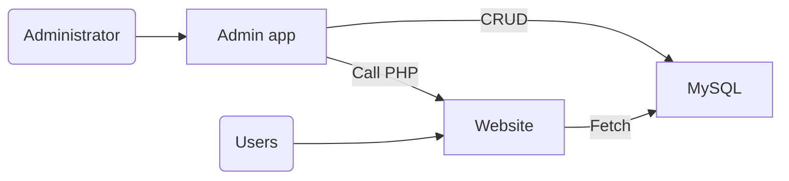

## Story
This was one of the first projects I was asked to work on as a developer while I was still a student. The client wanted a website to showcase their products and services, but also needed an admin panel to manage content on the backend to make it easier for them to manage everything without having to rely on a developer every time. This was a great opportunity for me to learn and apply my skills.

I'd never worked on design and had no experience with Photoshop, so I asked my classmate to do the design while I focused on the functionality and backend of the website. Today, there are many website templates and UI kits available to make things easier. And with modern frameworks like Angular or React, we don't have to worry about design and can focus on coding. But those days were different.

_Demo._

## Requirements
- Create a website
- Create an admin application to
  - Manage left menu
  - Manage product list
  - Manage content of static pages

## Solution
Stack used:
- C#/.NET WinForms
- PHP
- HTML/JavaScript
- MySQL

Designing a website was a challenge for me at the time because I had no experience with design tools. However, I was able to work closely with the designer classmate to implement it. It might not look perfect, but what's more important is that it met the client's needs.

The most interesting things were invisible to regular users - the client app for administration. I created a .NET WinForms application with the following functionality:
- Manage a website by connecting to it, so theoretically might be reused for other websites
- Manage menu items by adding/removing/editing them
- Manage product list by adding/removing/editing products
- Manage page content by editing HTML/text of pages using WYSIWYG editor

This application connected to the website database using MySQL to perform CRUD operations. It allowed editing existing content as well as adding/removing products, menu items, etc. directly from the .NET application backend without touching any code. When product categories changed, the .NET application would call a specific PHP endpoint to generate a new menu structure on the website. This was not necessary logic, but it was done for performance optimization.

## Conclusion
- This was a great learning experience for me as a student to work on a real project with real requirements and constraints
- I learned the importance of clear communication and managing expectations with the client
- Designing a user friendly and easy to use admin interface is just as important as the public website
- Having a dedicated designer on the project helped to divide responsibilities and ensure that each part was handled by the right person
