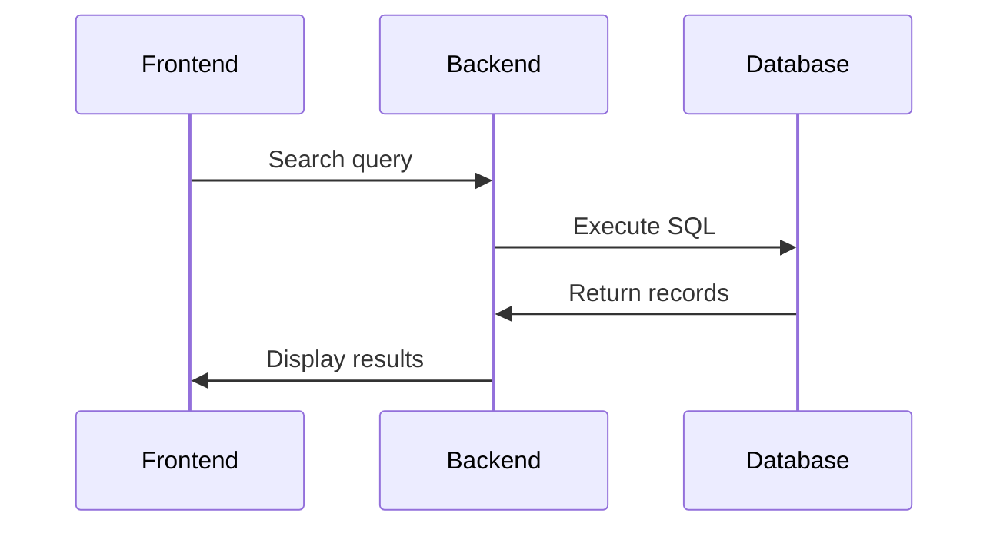

## Story
When I started my career as a quality engineer, one of the challenges I faced was finding requirements in a large document repository. There was no real way to search and filter requirements. It took a lot of time to find relevant requirements for each task, so they were rarely used in practice. At some point, I decided to automate this process by developing a desktop application that could search through all requirements documents based on my query.

Later, I wanted to share this application with others on my team. So I turned it into a web application using C#. I created my own web server and ran the search logic on the server side. I had the requirements converted from a document repository to a SQLite database, which was really fast compared to searching the documents as I had done in my first solution.

Over time, we discovered that the documents we had were actually exported from an external system that we did not have access to through the official requirements management software. However, we were allowed to connect to that system's database. So I had to update my web application to connect directly to the external database and perform searches there instead of relying on my local database. The only problem was that my existing solution was not very good for this purpose. Since the application had become quite popular, I needed to make sure it could handle a larger load and be ready for deployment on a dedicated server. So I had to rethink the future solution with the new requirements in mind.

## Demo

_Start page_



## Requirements
- Develop a web application to search for requirements stored in an external Oracle database.
- Be able to handle higher load as it will be used by multiple teams
- Improve UX/UI to look more professional using Bootstrap
- Add more functionality to support popular search queries

## Solution
Stack used:
- Java
- JSP
- JavaScript
- Tomcat
- Bootstrap
- jQuery

The general idea is quite simple. Application receives search query from user, converts it to SQL, then execute SQL query to Oracle database and map results to Java objects to display them on JSP page using bootstrap for styling.



### Frontend
The frontend consists of a single JSP page and a static HTML page, since there was not much logic on the `Help' page. Here is the JSP syntax for the reference.

```jsp
...
<%-- Generate page title --%>
<c:set var="appDisplayName" value="Online Requirements"/>
<c:choose>
    <c:when test="${empty param.value}">
        <title>${appDisplayName}</title>
    </c:when>
    <c:otherwise>
        <title>${param.value} - ${appDisplayName}</title>
    </c:otherwise>
</c:choose>
...
```

There were also some Javascript files to identify query type, highlight keywords in results, support pagination, and add some animations.

As the previous version of the application became popular, I collected statistics about popular query formats and got feedback about what was missing. As a result, I extended search queries to allow filtering queries by additional attributes. In addition, I removed the need to select the search type in advance, since the search query type depends on the actual input, and so I can detect it automatically by parsing the user input. This was done on the client side to reduce computation on the server.

```js
function getSearchBy(userInput) {
    function removeExtraWhiteSpaces(userInput) {
        if (userInput === null)
            return null;
        return userInput
                .replace(/(^\s+|\s+$)/, "")           // remove white spaces at the beginning and at the end
                .replace(/(\s+,\s+|\s+,|,\s+)/g, ",") // remove white spaces near commas
                .replace(/(\s+-|\s+-\s+|-\s+)/g, "-") // remove white spaces near dashes
    }
    userInput = removeExtraWhiteSpaces(userInput);

    function isSearchById() {
        var idPart = new RegExp(/(FR|NFR)\d+/i);
        var idFull = new RegExp(/(\D+\d*)-(FR|NFR)\d+/i);
        return idPart.test(userInput) | idFull.test(userInput);
    }

    function isSearchByTms() {
        var pattern = new RegExp(/\D{3,7}\d?-\d+/i);
        return pattern.test(userInput);
    }

    if (userInput === "")
        return null;
    if (isSearchById())
        return SearchByEnum.ID;
    if (isSearchByTms())
        return SearchByEnum.TMS;
    return SearchByEnum.TEXT;
}

function updateSearchBox() {
    var formSearchBy = $("#input-group-addon");
    var searchText = $("#value").val();
    var searchByEnumId = getSearchBy(searchText);
    if (searchByEnumId !== null) {
        formSearchBy.text(SearchByEnum.properties[searchByEnumId].display);
        return;
    }
    formSearchBy.text(SearchByEnum.properties[2].display);
}

$("#value").keyup(function () {
    updateSearchBox();
});
```

### Backend
However, there is still some work to be done on the server side to expand search ranges like `FR1-10` to `FR1,FR2,FR3...FR10`. Also, user input may contain enumerations like `keyword A, keyword B, keyword C`, which should become separate parameters in the final SQL query.

The application supports a variety of user inputs.

| Entity      | Type                | Examples                    |
| ----------- | ------------------- | --------------------------- |
| Requirement | Exact match         | `PRJ-FR1`                   |
| Requirement | Partial match       | `FR1`, `NFR1`               |
| Requirement | Range               | `PRJ-FR1-10`                |
| Requirement | Partial range       | `FR1-10`, `PRJ-FR1-10`      |
| Requirement | List                | `FR1,FR2,PRJ-NFR-3`         |
| Client code | Exact match         | `COBRA-12345`               |
| Client code | Partial match       | `COBRA-123`                 |
| Client code | List                | `COBRA-12345`,`COBRA-67890` |
| Text        | Contains word       | `api`                       |
| Text        | Contains phrase     | `web api`                   |
| Text        | Contains words list | `api,performance`           |
| Hierarchy*  |                     | `10.0-1`, `10.0-2.0-1`      |
{: .m-auto }

Hierarchy is a special notation that establishes the connection between parent/child requirements, so when used, the application should return the list of closest parent/child requirements that are connected.

As you can see, there are quite a few query types supported, so it was a challenge to parse and generate a proper SQL query. Fortunately, I had a set of end-to-end automated tests that allowed me to make changes with confidence because each case was carefully tested.

### Database
The good thing about Tomcat is that it can take care of maintaining and managing the pool of connections to the database, so we don't have to worry about it. For my future application, I defined a context with a database resource for Tomcat.

```xml
<Context path="/orqs">
    <Resource
        driverClassName="oracle.jdbc.OracleDriver"
        logAbandoned="true"
        maxIdle="8"
        maxTotal="8"
        maxWaitMillis="60000"
        name="jdbc/oracle9_requirements"
        type="javax.sql.DataSource"
        auth="Container"
        url="jdbc:oracle:thin:@192.168.1.1:1521:DB"
        username="admin"
        password="admin"/>
        -->
</Context>
```

And then used it in my application by requesting a connection to the database when I need to execute the search query.

```java
Connection connection = null;
PreparedStatement statement = null;
ResultSet set = null;

try {
    Context initContext = new InitialContext();
    Context context = (Context) initContext.lookup("java:/comp/env");
    DataSource dataSource = (DataSource) context.lookup("jdbc/oracle9_requirements");

    connection = dataSource.getConnection();
    statement = connection.prepareStatement(selectSqlStatement);

    if (whereArguments != null) {
        int i = 1;
        for (String argValue : whereArguments) {
            statement.setString(i++, argValue);
        }
    }

    set = statement.executeQuery();
    ...
    }
...
```

## Conclusion
- It is a pure pleasure to build something that helps people in their daily lives.
- It was a great learning experience for me to work on this application from start to finish. I later used it for my own purposes to learn how to build end-to-end automated tests.
- I'm grateful to myself for writing good development documentation, which helped me refresh the requirements in my head and prepare the local development environment years later. I think the people who support this project at this time will appreciate my efforts.
- Unfortunately, I didn't create automated tests for the search query parsing and database SQL generation logic during the initial development. This made it difficult to make changes to the search logic and SQL generation later. Writing automated tests from the beginning would have prevented bugs and allowed for confident refactoring.
