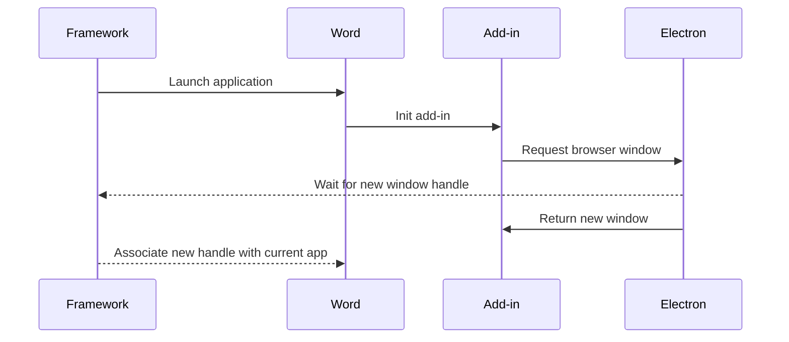

## Story
In general, this is a typical task for any test automation engineer to spin up a test project for a web or desktop application. However, sometimes there are projects that require a bit more effort and research to get started. Testing Office add-ins is one such case.

What is a Microsoft Office add-in? Whenever you start Microsoft Word, Excel, PowerPoint, or Outlook, a side panel appears that is an add-in. The Wikipedia add-in is shown as an example in the screenshot below.


_Example of a Word add-in_

In my case, add-in loaded a web browser and then a web content, which is React application. So testing it required both UI automation for Office desktop application and web application testing.

## Requirements
Build a test framework that can:
- Launch a Microsoft Office application (Word, Excel, etc.)
- Launch Microsoft Office application in a specific state/mode (e.g., Word in read-only or protected mode)
- Connect to the browser inside the add-in and expose the `WebDriver` instance
- Support simultaneous work with multiple instances of Office applications

## Solution
The test framework is built using Selenium[^Selenium] for web application part and FlaUI[^FlaUI] for UI automation of Microsoft Office applications. I chose FlaUI because it supports UIA3 automation, which works best for WPF applications.

The solution includes the following projects:
- `Office`, which is responsible for launching applications and creating documents such as read-only and protected documents.
- `AddIn`, which handles add-in loading and exposes WebDriver instance
- `PageObjects`, which contains page object model for web application
- `Tests` project with our tests using Office, AddIn, and PageObjects projects
- `Office.UnitTests` project with unit tests for Office project
- `AddIn.UnitTests` project with unit tests for AddIn project

### Connect to web browser
As for the regular browser, in order to have control over it, we need to specify the debug port number. In my case, the browser instances were created by the Electron application, which was part of the overall solution.

```csharp
public class ElectronApp
{
    private int _processId;

    public void Start()
    {
        var args = string.Format("--remote-debugging-port={0}", _configuration.DebugPort);
        var startInfo = new ProcessStartInfo(
            Path.Combine(_configuration.ElectronApp.Location, _configuration.ElectronApp.BinaryName),
            args);
        _processId = _application.Start(startInfo);
    }
}
```

Once the Electron application is launched, we can connect to it.

```csharp
internal class WebDriver
{
    private static WebDriver s_instance;

    private void Start()
    {
        var options = new ChromeOptions
        {
            DebuggerAddress = _configuration.DebugPort
        };

        var service = ChromeDriverService.CreateDefaultService();
        service.HideCommandPromptWindow = true;

        var driver = new ChromeDriver(service, options);
        driver.Manage().Timeouts().ImplicitWait = _configuration.findElementTimeout;

        s_instance = driver;
    }
}
```

### Expose WebDriver within the application context
With the connection established, it's time to think about how to expose the WebDriver instance to tests. Since we'll be working with multiple Office applications and add-ins simultaneously, it's important to bind the WebDriver instance to the specific application context.

Knowing the exact actions that cause new browser instances to be spawned, such as add-in initialization on Office application startup, allows us to hook into these events and associate new window handles with the appropriate application context.



Here is what the `Word` class might look like. When we start a new Word instance, we associate a new WebDriver context with it.

```csharp
public class Word
{
    public WebDriverContext WebDriverContext { get; private set; }

    public void Start()
    {
        var app = new Application();
        app.Start();
        WebDriverContext = WebDriver.GetNewContext();
    }
}
```

The `WebDriver` class will handle WebDriver instance management and return new context. It will check for a new window handle that was not seen before and return it.

```csharp
internal class WebDriver
{
    private static readonly IList<string> s_knownHandles = new List<string>();

    public WebDriverContext GetNewContext()
    {
        if (s_instance == null || !IsRunning())
        {
            s_instance = new WebDriver();
            s_instance.Start();
        }

        var cts = new CancellationTokenSource(_configuration.waitForTabTimeout);
        while (!cts.IsCancellationRequested)
        {
            if (s_instance.WindowHandles.Count > 0)
            {
                var window = s_instance.WindowHandles?.FirstOrDefault(x => !s_knownHandles.Contains(x));
                if (!string.IsNullOrEmpty(window))
                {
                    s_knownHandles.Add(window);
                    if (s_instance.SwitchTo().Window(window).Url.StartsWith("chrome-extension://"))
                    {
                        continue;
                    }
                    return new WebDriverContext(s_instance, window);
                }
            }

            Thread.Sleep((int)_configuration.waitForTabSleep.TotalMilliseconds);
        }
    }
}
```


`WebDriverContext` is a wrapper for the Selenium `WebDriver` that makes sure to switch to the correct application context before executing a command.

```csharp
public class WebDriverContext
{
    public IWebDriver WebDriver
    {
        get
        {
            SwitchToCurrentContext();
            return WebDriverInstance;
        }
    }

    public IWebElement FindElement(By by)
    {
        return WebDriver.FindElement(by);
    }

    private void SwitchToCurrentContext()
    {
        if (GetCurrentWindowHandle() != _windowHandle)
        {
            WebDriverInstance.SwitchTo().Window(_windowHandle);
        }
    }
}
```

Now we can stop worrying about browser windows and contexts. The `WebDriverContext` class takes care of this and makes sure that all web commands are executed in the correct application context.

```csharp
public class DemoTests
{
    [Test]
    public void WhenMultipleInstances_ThenWeDoNotWorry
    {
        // Arrange
        var word = new Word();
        word.Start();
        var webAppInWord = new WebApp(word.WebDriverContext);

        var excel = new Excel();
        excel.Start();
        var webAppInExcel = new WebApp(excel.WebDriverContext);

        // Act
        word.BringMainWindowToFront();
        webAppInWord.DemoButton.Click();

        // Assert
        excel.BringMainWindowToFront();
        Assert.That(webAppInExcel.DemoInput.Text, Is.EqualTo("Demo"));
    }
}
```

### Windows automation
Office applications that support working with documents, such as Word, Excel, and PowerPoint, allow documents to be opened in read-only and protected view modes, where the user has limited permissions. Protected view mode is enabled when the user opens an untrusted document. For example, if the document is downloaded from the Internet. Since our tests needed to cover such scenarios, I had to implement a way to create read-only and untrusted documents.

When a document is downloaded from the Internet, Windows marks it as untrusted by adding a zone identifier to its file attributes. So to create an untrusted document programmatically, I added a method to create a temporary file and add a zone identifier stream to mark it as downloaded from the Internet. This will enable the protected view mode when the document is opened.

```csharp
public abstract class DocumentBase: IDocument
{
    public abstract string Create(string path, string filename, string content = null);

    public string CreateTemporaryUntrusted(string content = null)
    {
        var filePath = CreateTemp(content);
        var fileInfo = new FileInfo(filePath);
            var stream = fileInfo.GetAlternateDataStream("Zone.Identifier", FileMode.Create);
            using (var zoneStream = stream.OpenWrite())
            {
                using (var writer = new StreamWriter(zoneStream))
                {
                    writer.WriteLine("[ZoneTransfer]");
                    writer.WriteLine("ZoneId=3");
                }
            }
            return filePath;
    }

    public string CreateReadOnlyTemporary(string content = null)
    {
        var filePath = CreateTemp(content);
        File.SetAttributes(filePath, FileAttributes.ReadOnly);
        return filePath;
    }

    public string CreateTemporary(string content = null)
    {
        var tempPath = Path.GetTempPath();
        var filename = Path.GetFileNameWithoutExtension(Path.GetRandomFileName());
        return Create(tempPath, filename, content);
    }
}
```

## Conclusion
While the solution worked, it was not without its drawbacks. Due to the nature of desktop automation, it was not possible to run tests in parallel mode on the same machine/session, or to run tests in headless mode. Each CI agent required additional configuration to run these tests. In addition, these tests were quite slow because it takes time to run a process as heavy as an MS Office application. Therefore, we had to keep an eye on the scenarios we were automating to maintain a small test suite. The focus was on other testing solutions, while scenarios that needed to run in the Microsoft Office environment had to be written using this framework.

## References
[^Selenium]: [Selenium](https://www.selenium.dev/)
[^FlaUI]: [FlaUI](https://github.com/FlaUI/FlaUI)
