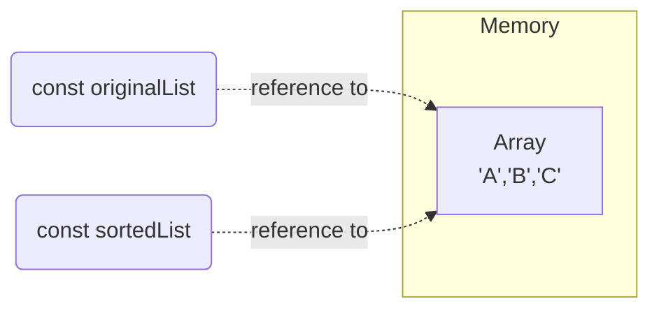

## Introduction
Over the past few months, I've encountered a recurring situation during code reviews for newly developed automated end-to-end tests across various projects and programming languages. It's understandable to make mistakes in the code, but there is a different aspect of this situation.

## Case study
Let me share an example so we can go through it together. Imagine a test that needs to verify that some data in the list appears ordered in the UI.

<pre class="d-flex justify-content-center">
🛒Shopping list
  ☑️ Apples
  ☑️ Bread
  ☑️ Cheese
  ☑️ Eggs
  ☑️ Milk
 </pre>

If there are no built-in assertions to verify the list is ordered, one of the custom solution could be:
1. get original list items from UI
1. create a copy of the list and sort it
1. compare original list with sorted one

If both lists are the same, it means that the original list has been sorted and is working as expected. Here is what is submitted for code review.

```ts
test('list is sorted alphabetically', async ({ page }) => {
  // get original list items from UI
  const rows = page.getByRole('listitem');
  const originalList = await rows.evaluateAll(
    list => list.map(element => element.textContent));

  // create a copy of the list and sort it
  const sortedList = originalList.sort();

  // compare original list with sorted one
  expect(originalList).toStrictEqual(sortedList);
});
```

When I provide feedback by stating that this approach will not work, and the test will consistently pass, I've noticed that there is sometimes a lack of understanding. Consequently, I find it necessary to supplement my comment with an illustrative example, as demonstrated below.

```ts
test('list is sorted alphabetically', async () => {
  // obviously not sorted list
  const originalList = ['B', 'A', 'C'];

  // create a copy of the list and sort it
  const sortedList = originalList.sort();

  // compare original list with sorted one
  expect(originalList).toStrictEqual(sortedList);
});
```

Now people get really curious what is going on when they see the test execution result.

```bash
$ npm run test

Running 1 test using 1 worker
·
  1 passed (3.1s)
```

The test is passing but it is not really testing anything. The code is not verifying that functionality is working as expected.

### Problem #1: Value vs Reference types
The challenge that individuals may face is a lack of understanding of the differences and specific behavior of value and reference types in their programming language. In the given example, the statement `const sortedList = originalList` doesn't create a copy of `originalList`; instead, it associates both variables with the same list, resulting in shared use.



As a result, any comparison of these two will cause the test to pass, because we are comparing the list against itself.

### Problem #2: No tests for test
This is something we have to deal with. No one is going to write tests for tests. But code for tests is code, and it needs to be tested. We do that by running tests. However, especially if we are not following a TDD approach, we need to make sure that our test is able to find the problem we wanted it to find when we decided to write the test.

## Conclusion
Here are some recommendations to follow when creating tests:
- Make sure that the code you create does what you think it should do.
- Run the test under conditions where you expect it to fail to prove that it can.
