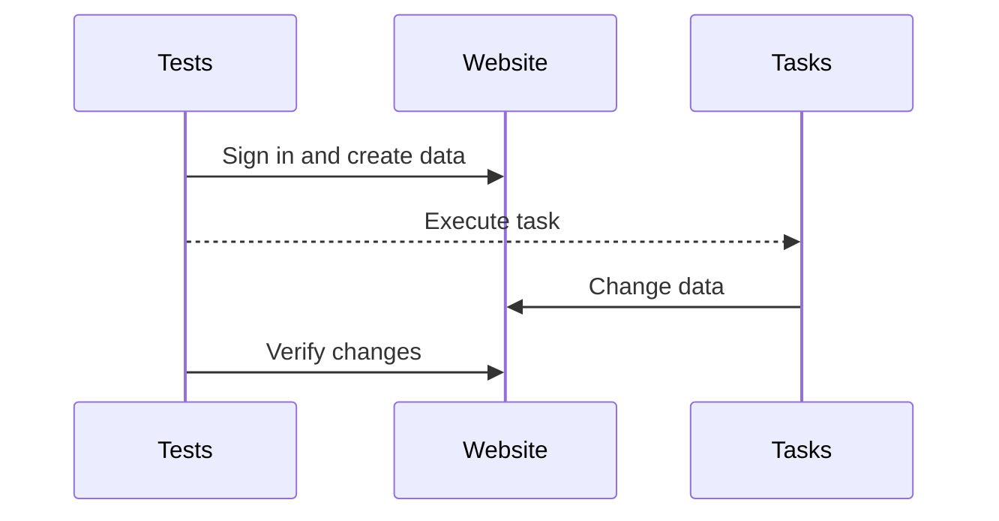

## Story
Sometimes there is no "standard" way to do things, as in this example. The team had to brainstorm to figure out how to automate E2E tests that involve running tasks from the remote machine. Imagine, we need to log in to a website, create some data, then execute a task that resides on a dedicated server and validate that there are some changes happened to our data in a website. How can we do this remotely and automatically? Manually, this process required connecting to a remote machine and manually executing tasks. In production, this is done automatically on schedule, so there is no built-in logic to do it on demand.



Most test automation frameworks out there, such as Playwright, CodeceptJS, focus on browser-based UI automation and support API testing out of the box. But executing tasks and validating results is not easy. I came up with the idea to turn this process into regular API testing instead.

## Requirements
- There are hundreds of tasks that we need to be able to run
- We need to pass parameters to tasks and get results back
- Tasks should be able to run remotely on a dedicated server

## Solution
Stack used:
- ASP.NET Core Web API
- C#/.NET Console App

I have created an ASP.NET Core Web API solution that exposes endpoints:
- Run a task by name
- Get a list of executed tasks
- Retrieve task execution details such as status, output, and any errors
- Download output files created by a specific task

Once a task execution is triggered through the API, the API returns a task ID. The new task is picked up by the `TaskRunner` service, which uses the `Process` class to pass the executable name, path, and any parameters. So a typical task execution workflow looks like this:

- Send an API request to run the task: `POST /api/tasks/taskName=Demo`
- Check task execution status and result: `GET /api/tasks/7c9e6679-7425-40de-944b-e07fc1f90ae7`

When a new task is created and placed in the in-memory database, an event is fired to notify `TaskRunner` that new tasks are available for execution. The in-memory database is used to store all executed tasks, their status, output, etc. This allows to easily check the execution status and results. However, all the information is lost when the API service is restarted, which is fine for this specific solution.

There are hundreds of tasks we had to deal with. The API knows about all of them to be able to run any task by just passing a name of it. This was done by creating a separate console application that parsed the task metadata and definitions and exported them as a JSON file that was then read by the API on startup. This way we avoided hardcoding all task metadata into the API project or E2E tests themselves, and made it easy to add/remove/update tasks.

### Usage in tests
After all, this is what the BDD E2E tests looked like:

```cucumber
Scenario: Verify old cases are closed by "Close old cases" remote task
  Given I am logged in to application
  When I open case number "#12345"
  When I execute remote task "Close old cases"
  Then I see case status is "Closed"
```
{: .nolineno }

## Conclusion
This solution allowed us to easily automate these workflows from within our E2E testing framework by simply calling API endpoints. We were able to execute any task remotely on demand, check status and results. It also allowed us to abstract away all the complexities of task execution and focus solely on testing the business logic and flows. Overall, the API approach worked well for our use case, automating what was previously done manually.

Having the API in place opens the door to other possible improvements. It is now possible to restrict access to dedicated server hosting tasks and create a website UI on top of the API to manage tasks and executions in a user-friendly way. Security could be improved by adding authentication/authorization to API endpoints.
