## Introduction
There is a well-known and widely used term called REST API. I'm pretty sure you've had to deal with it when developing and testing software products. However, there are other types of APIs, not only by response type, but by the mechanism of keeping the connection open to provide constant chunks of data, or so called stateful API. Let's look at and compare the following two: REST and Streaming APIs.

## REST API vs Streaming API
The REST API is good for providing a single response per client request, as is so common in enterprise solutions, to return some data to the client so it can display the data to the end user.


Streaming API is better option in case you need to transfer huge amount of data or provide data updates with minimum possible delay through API.

```mermaid
sequenceDiagram

Client->>Server: What is the temperature of the water in the kettle?
Server->>Client: It's 40°C now
Server->>Client: It's 60°C and heating up
Server->>Client: It's already 80°C
Server->>Client: It's 96°C and perfect to make tea now
```



## Example
### REST API
Here is a simplified canonical example of a typical REST API service using ASP.NET.

```csharp
var builder = WebApplication.CreateBuilder(args);
var app = builder.Build();

app.MapGet("/weather", () =>
{
    var forecast = new WeatherForecast
        (
            DateTime.Now,
            Random.Shared.Next(-20, 55)
        );
    return forecast;
});

app.Run();

record WeatherForecast(DateTime DateTime, int Temperature);
```

I can send a `GET` request to the `/weather` endpoint and get a response like this.

```json
{"dateTime":"2024-02-22T16:39:12.5426819+04:00","temperature":47}
```

### Streaming API
Here is an example of the same solution converted to the Streaming API.

```csharp
using System.Runtime.CompilerServices;

var builder = WebApplication.CreateBuilder(args);
var app = builder.Build();

app.MapGet("/weather", GetWeatherForecasts);

async IAsyncEnumerable<WeatherForecast> GetWeatherForecasts(
    [EnumeratorCancellation] CancellationToken cancellationToken)
{
    while (!cancellationToken.IsCancellationRequested)
    {
        var forecast = new WeatherForecast
        (
            DateTime.Now,
            Random.Shared.Next(-20, 55)
        );
        Console.WriteLine(forecast);
        yield return forecast;
        await Task.Delay(500, cancellationToken);
    }
}

app.Run();

public record WeatherForecast(DateTime DateTime, int Temperature);
```

Now, when I call the `/weather` endpoint, it returns a new piece of data twice per second in this case.

```json
[{"dateTime":"2024-02-22T17:02:06.2156144+04:00","temperature":2},
{"dateTime":"2024-02-22T17:02:06.7562151+04:00","temperature":2},
{"dateTime":"2024-02-22T17:02:07.2721409+04:00","temperature":9},
{"dateTime":"2024-02-22T17:02:07.7861762+04:00","temperature":16},
```

Here is a live demo of this request/response behavior using regular browser.



You may have noticed that JSON starts with a `[` symbol, which means that this is the beginning of an array that never actually ends. When the client disconnects, the method execution is aborted with a `CancellationToken` and no more data is passed to the client. This leads to some challenges that I'll discuss below.

## Testing
When it comes to writing functional or integration tests, the behavior of the Streaming API makes it even more challenging. Pause for a moment and think about how you would write a test for a streaming endpoint when the response to a request returns an infinite amount of data, so reading the response never ends.

### REST API testing
First, let's take a look at a typical test for the REST API.

```csharp
[Test]
public async Task GetWeather_WhenCalled_ReturnsWeather()
{
    // Arrange
    var factory = new WebApplicationFactory<Program>();
    var client = factory.CreateClient();

    // Act
    var response = await client.GetAsync("/weather");
    var content = await response.Content.ReadAsStringAsync();
    var weather = JsonSerializer.Deserialize<WeatherForecast>(content,
        new JsonSerializerOptions() { PropertyNameCaseInsensitive = true });

    // Assert
    Assert.Multiple(() =>
    {
        Assert.That(response.StatusCode, Is.EqualTo(HttpStatusCode.OK));
        Assert.That(weather!.DateTime.Date, Is.EqualTo(DateTime.Now.Date));
        Assert.That(weather!.Temperature, Is.InRange(-20, 55));
    });
}
```

Here I send a `GET` request to the `/weather` endpoint, read the response as a `string`, and then convert it back into a `WeatherForecast` model so that I can verify the data I received.

### Streaming API testing
The first idea you might have is to use `CancellationToken` to cancel the execution of the request. However, we need to make sure that some data has already been returned so that we can use it in our test. Also, you may not want to spend extra time retrieving unwanted data, so you will need to cancel the request at some point. Taking this into account, we can't use this approach like below.

```csharp
// You don't want to do it just like that.
var cts = new CancellationTokenSource(TimeSpan.FromSeconds(1));
```

So, in addition to the `CancellationToken`, I can propose to read the data from a response and cancel as soon as the first part of the data is received.

```csharp
[Test]
public async Task GetWeather_WhenCalled_ReturnsWeather()
{
    // Arrange
    var factory = new WebApplicationFactory<Program>();
    var client = factory.CreateClient();

    // Act
    var response = await client.GetAsync("/weather",
        HttpCompletionOption.ResponseHeadersRead);
    var content = await GetFirstPortionOfContent(response, TimeSpan.FromSeconds(1));
    content = content.TrimStart('[');
    var weather = JsonSerializer.Deserialize<WeatherForecast>(content,
    new JsonSerializerOptions() { PropertyNameCaseInsensitive = true });

    // Assert
    Assert.Multiple(() =>
    {
        Assert.That(weather.DateTime.Date, Is.EqualTo(DateTime.Now.Date));
        Assert.That(weather.Temperature, Is.InRange(-20, 55));
    });
}

private async Task<string> GetFirstPortionOfContent(
    HttpResponseMessage response,
    TimeSpan timeout)
{
    var cts = new CancellationTokenSource(timeout);
    await using var contentStream =
        await response.Content.ReadAsStreamAsync(cts.Token);
    const int bufferSize = 2048;
    var buffer = new byte[bufferSize];
    var result = new List<byte>();

    var readBytes = 0;
    while (!cts.IsCancellationRequested
        && (readBytes = contentStream.Read(buffer)) != 0)
    {
        for (var i = 0; i < readBytes; i++)
        {
            result.Add(buffer[i]);
        }

        break;
    }

    return Encoding.UTF8.GetString(result.ToArray());
}
```

Here I just wait for the response headers to make sure the request has been processed and data should be available. Then I read the response as a stream until it's finished and stop processing the request right after that. If no data is available, the response processing is aborted by a timeout.

While it works somehow, there are several problems with this approach:
- The stream may never end if a new piece of data becomes available fast enough, I suspect.
- Unexpected amounts of data may be processed. If I increase the speed of the weather forecast by changing `Task.Delay(500)` to `Task.Delay(0)`, the captured response may contain only a portion of the data at some point.

```json
[{"dateTime":"2024-02-23T04:13:38.6071111+04:00","temperature":52},
 {"dateTime":"2024-02-23T04:13:38.6163497+04:00","temperature":6},
 {"dateTime":"2024-02-23T04:13:38.6164083+04:00","temperature":27},
 {"dateTime":"2024-02-23T04:13:38.6164142+04:00","temperature":37},
 {"d
```

- As I mentioned earlier, we have `[` as the first character in the response that we need to cut in order to be able to cast the response to a model.

### Streaming API testing - better approach
It might be foolish to think that I am the first person to face this problem. Hopefully the DotNet team has already done everything for us.

```csharp
[Test]
public async Task GetWeather_WhenCalled_ReturnsWeather()
{
    // Arrange
    var factory = new WebApplicationFactory<Program>();
    var client = factory.CreateClient();

    // Act
    var stream = await client.GetStreamAsync("/weather");
    var weather = await GetWeatherFromStream(stream);

    // Assert
    Assert.Multiple(() =>
    {
        Assert.That(weather.DateTime.Date, Is.EqualTo(DateTime.Now.Date));
        Assert.That(weather.Temperature, Is.InRange(-20, 55));
    });
}

private async Task<WeatherForecast> GetWeatherFromStream(Stream stream)
{
    var cts = new CancellationTokenSource(TimeSpan.FromSeconds(5));
    var weathers = JsonSerializer.DeserializeAsyncEnumerable<WeatherForecast>(
        stream,
        new JsonSerializerOptions() { PropertyNameCaseInsensitive = true },
        cts.Token);

    try
    {
        await foreach (var weather in weathers)
        {
            await cts.CancelAsync();
            return weather;
        }
    }
    catch (TaskCanceledException)
    {
    }

    throw new InvalidDataException();
}
```

In this example, I get the stream and then use `JsonSerializer.DeserializeAsyncEnumerable` to read the response, which does all the work. It makes sure that the right amount of data is available to deserialize the response content, so I can then iterate over the available chunks and stop at a given point when I decide I have enough data samples for my test. How cool is that?!
