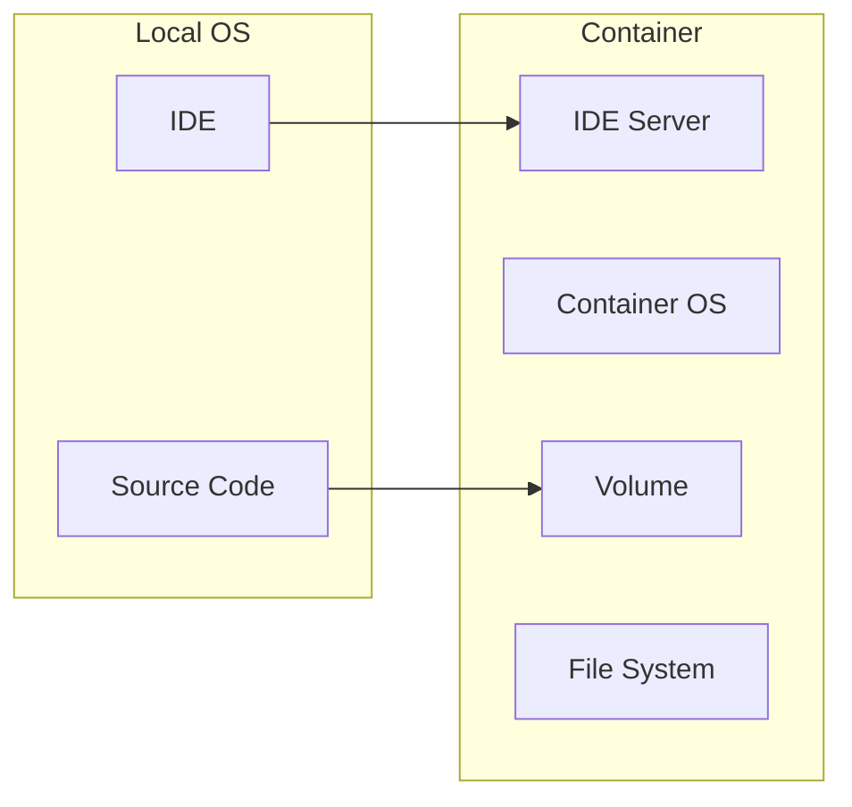

## Introduction

Cross-platform development has always been a challenge. Hopefully, there are solutions available today that mitigate some of these challenges. The "write once, run everywhere" paradigm is gaining popularity thanks to .NET, NodeJS, Electron, and many other technologies.

The other thing I really like is "everything is code," which is heavily used in DevOps practice, giving us great tools like Nuke, Webpack, and others. Even documentation is generated from Markdown format, which seems to be an industry standard.

We deploy and run applications in Docker containers, which gives us many benefits. We are also building applications in Docker containers. It seems that the development environment is the last thing that has not been adapted to today's needs.

## Overview

The idea is to use the Docker container as the development environment during the development process. In theory, this helps to completely eliminate some of the problems associated with configuring the development environment.

The good news is that development containers are already widely supported by Visual Studio[^MicrosoftVisualStudio], VS Code[^MicrosoftVisualStudioCode], Rider[^JetBrainsRider], and others, but with limited support mostly. There are platforms that allow you to spin up development containers remotely, such as GitHub[^IntroductionToDevContainersByGitHub]. This all possible due to the Open Development Container Specification[^DevelopmentContainerSpecification].

### Configuration

To run containers, you need to have Docker installed on your machine so that the IDE can create development containers from the configuration definition. While it's possible to use Docker alternatives, it works best with Docker because there are limitations and additional configuration required for others.

There are several ways to get started. One is to use the IDE workflow which will generate a configuration file for you. Alternatively, you can use CLI tools, or to create the configuration definition manually by creating a `devcontainer.json` file.

```json
{
  "name": "foo",
  "image": "mcr.microsoft.com/devcontainers/typescript-node",
  "onCreateCommand": "npm install",
  "customizations": {
    "vscode": {
      "extensions": ["streetsidesoftware.code-spell-checker"]
    }
  },
  "forwardPorts": [3000]
}
```
{: file="devcontainer.json" }

You can define a single development container configuration for a repository, different configurations for different branches, or multiple configurations. The development container configuration can be based on `Dockerfile` or `docker-compose.yml`, so you don't have to maintain two copies of container configurations.

### How it works

The main difference from typical containers is that they are specifically configured to provide a full-featured development environment, complete with all the tools and runtimes you need to work on a specific project.



Devcontainer images are a bit different from typical images. Devcontainer images come with pre-built tools and runtime stack specific to development container image, also they are not designed to be used for hosting applications in production as permissions and OS configuration could be adjusted to make it easier to use. But what makes a huge difference is the Visual Studio Code Server that runs inside the container, which allows you to run formatters and linters, use a predefined list of Visual Studio Code extensions, and even scan the container output and integrate all of this with the IDE running locally. So you are basically using the IDE as a terminal to connect to the remote development environment.

There are a number of ready-made development containers available[^OfficialMicrosoftImages]. You can create a custom one[^DevContainerTemplatesSelfAuthoringGuide] including custom features[^DevContainerFeaturesSelfAuthoringTemplate] for devcontainers. Features are self-contained units of installation code and development container configurations that can be installed along with the primary image, allowing you to mix .NET and NodeJS in a single devcontainer configuration, for example, or use them to extend your existing `Dockerfile` definition just for development purposes.

## Benefits

There are many advantages to using devcontainers.

- It takes less time to spin up a local development environment.
> Even if your project needs to heavily customize the image by installing additional software, configuring tools, etc., you can take advantage of the ability to create your own base image that will be used by the devcontainer configuration.

- Easy and fast onboarding process for new team members.
- Easy to reproduce problems using the same environment.
- The development environment is documented and any changes made to it can be reviewed as part of the code review process.
- Remote code execution makes it a little more secure, but it can still run malicious code.
- Isolated environment eliminates potential conflicts between projects and locally installed libraries and tool versions.

## Disadvantages and limitations

There is no ideal solution. Like any other, it has some drawbacks.

- There may be unexpected problems while working with the container, and you will need to find solutions or workarounds.
> For example, watch mode may not work, shell auto-completion, problems with user permissions, etc.

- Containers require additional resources such as disk space, memory, and CPU.
- All Intel-based computers, whether they are running Windows, Linux, or MacOs, will have the same behavior. However, the latest Mac architecture (Apple M1/Silicon), which is ARM64, means that the behavior is not the same when creating development containers.
- Using devcontainers may force people to use the same IDE
> Due to the lack of support for some IDEs, your team may need to use the same IDE.
- Since devcontainers are pre-built with tools, people will not have the option to use others.
> While it's still possible to install or modify something inside the container, it will be harder to maintain personally. But that depends on what you want to change.

## Conclusion

Would I recommend using it? Well, it depends. There are no good or bad tools, and this one is no exception. I believe it needs more time to discover and reduce common issues related to it's usage, IDE support and can become a great seamless one-click way to spin up development environment. While it looks feature-rich even today, it is necessary to compare all the pros and cons for a particular project to make a proper decision. Nevertheless, I would recommend everyone to give it a try and integrate it into a smaller project to see how easy development environment management can be.

## References
[^MicrosoftVisualStudio]: [Microsoft Visual Studio](https://learn.microsoft.com/en-us/visualstudio/containers/?view=vs-2022)
[^MicrosoftVisualStudioCode]: [Microsoft Visual Studio Code](https://code.visualstudio.com/docs/devcontainers/containers)
[^JetBrainsRider]: [JetBrains Rider](https://www.jetbrains.com/help/rider/Connect_to_DevContainer.html)
[^IntroductionToDevContainersByGitHub]: [Introduction to dev containers by GitHub](https://docs.github.com/en/codespaces/setting-up-your-project-for-codespaces/adding-a-dev-container-configuration/introduction-to-dev-containers)
[^DevelopmentContainerSpecification]: [Development Container Specification](https://containers.dev/implementors/spec/)
[^OfficialMicrosoftImages]: [Official Microsoft images](https://mcr.microsoft.com/en-us/catalog?search=dev%20container)
[^DevContainerTemplatesSelfAuthoringGuide]: [Dev Container Templates: Self Authoring Guide](https://github.com/devcontainers/template-starter)
[^DevContainerFeaturesSelfAuthoringTemplate]: [Dev Container Features: Self Authoring Template](https://github.com/devcontainers/feature-starter)
