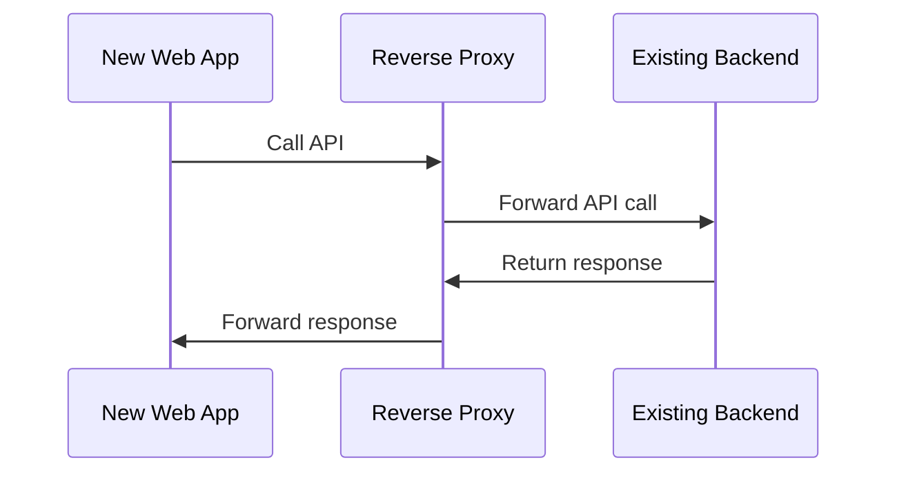

*[CORS]: Cross-Origin Resource Sharing (CORS) is an HTTP-header based mechanism that allows a server to indicate any origins (domain, scheme, or port) other than its own from which a browser should permit loading resources. For security reasons, browsers restrict cross-origin HTTP requests initiated from scripts.
*[YARP]: YARP (Yet Another Reverse Proxy) is an open-source reverse proxy toolkit designed for . NET applications.
*[MUI]: MUI (Material UI) is a React UI framework that implements Google's Material Design.
*[SPA]: Single-Page Application (SPA) is a web application or website that interacts with the user by dynamically rewriting the current web page with new data from the web server, instead of the default method of the browser loading entire new pages.
*[Redux]: Redux is a predictable state container for JavaScript apps.
*[Helm]: Helm is a package manager for Kubernetes.

## Story

Have you ever faced a situation where an application you use every day is missing a feature or workflow that you would like to have? What can a regular user do to get that feature added to the application? Well, it depends on the situation. I can think of contacting the developers and asking for it, hoping that the idea will be warmly accepted and implemented. I can vote for a feature in the case of open source projects, or if the project has a forum for user feedback.

However, you may be thinking about a workflow that is not compatible with the current vision and implementation of the existing project. This has been the case I have worked with.

## Requirements

- Create a brand new web application with the desired features to work alongside the existing one.
- Integrate new web application with existing backend API.

## Solution

Stack used:
- C#, ASP.NET, YARP.
- React, Vite, MUI, React Router, Redux Toolkit.

To meet all the requirements, I need to implement not only a brand new web application that will have new features and workflows I want to use, but also a new backend API. The reason behind this is that the existing web application works with a backend API that I cannot use directly when my new web application is deployed and accessed from a different address. If I would try to send an API request to it from browser, then it will refuse to process the request due to CORS. The good news is that CORS is a browser feature that makes it possible to talk to an API endpoint from any client running outside the browser.

Since I need to reuse the existing solution backend API, but make it possible to extend it for my possible future needs, I have decided to proceed with the reverse proxy. The general idea of application communication is as follows.



This architecture serves several purposes:
- Bypass CORS restrictions.
- Allows to store data on my own backend if needed.
- Allows implementation of new API endpoints.
- Allows to apply additional logic around API calls.

### Backend

Start by creating a new ASP.NET Core project.

```bash
$ dotnet new web -n MyApi -f net8.0
$ dotnet add MyApi.csproj package Yarp.ReverseProxy
```

Then modify the `Program.cs` file to configure the services and middleware.

```csharp
var builder = WebApplication.CreateBuilder(args);

builder.Services.AddReverseProxy()
    .LoadFromConfig(builder.Configuration.GetSection("ReverseProxy"));

var app = builder.Build();
// Proxy API requests to external system
app.MapReverseProxy();
// Fallback all browser requests to '/'
// so any URL will fallback to React app that lives in 'index.html'
app.UseStatusCodePagesWithReExecute("/");
// Serve static files as a web server
// so my custom web application could be accessed from the browser
app.UseFileServer();
app.Run();
```
{: file="Program.cs" }

Finally, modify the YARP configuration to proxy certain API requests to an external system.

```json
{
  "Logging": {
    "LogLevel": {
      "Default": "Warning",
      "Microsoft": "Warning",
      "Yarp": "Warning",
      "Microsoft.Hosting.Lifetime": "Information"
    }
  },
  "AllowedHosts": "*",
  "ReverseProxy": {
    "Routes": {
      "jtt-route" : {
        "ClusterId": "externalApi",
        "Match": {
          "Path": "api/{**catch-all}"
        },
        "Transforms": [
          { "X-Forwarded":  "Off" },
          { "RequestHeaderOriginalHost": "false" },
          {
            "RequestHeader": "Origin",
            "Set": "https://original-service.com/"
          }
        ]
      }
    },
    "Clusters": {
      "jtt": {
        "Destinations": {
          "jtt-production": {
            "Address": "https://original-service.com/"
          }
        }
      }
    }
  }
}
```
{: file="appsettings.json" }

My backend is ready. However, before I can launch it, I would like to create a certificate so that I can use HTTPS for local development.

```bash
$ dotnet dev-certs https --clean
$ dotnet dev-certs https -ep certificate.pfx -p password --trust
```

Now I am ready to start my proxy server.

```bash
$ dotnet run
```

### Frontend

Finally, I can get to work on the main part of the solution and start the creation of a brand new web application.

```bash
$ npm create vite@latest
```

#### Configuration

In production, the web application will be hosted by a proxy server. I have already configured it t do so previously. However, this requires to build web application in production mode. During development I want to use Vite's watch mode. For this purpose I need to configure Vite's built-in proxy server and point it to my new backend API since both projects use different port numbers. I also need to specify a certificate and build output folder.

```ts
import { defineConfig } from 'vite';
import react from '@vitejs/plugin-react';
import basicSsl from '@vitejs/plugin-basic-ssl';

export default defineConfig({
  server: {
    open: '/',
    proxy: {
      '/api': {
        target: 'https://localhost:7090/',
        changeOrigin: true,
        secure: false,
      },
    },
  },
  plugins: [
    react(),
    basicSsl({
      domains: ['localhost'],
      certDir: '../MyApi/certificate.pfx',
    }),
  ],
  build: {
    outDir: '../MyApi/wwwroot',
    emptyOutDir: true,
  },
});
```
{: file="vite.config.ts"}

Now I have my web application. I can launch it to see how it looks while continuing to work on adding new features.

```bash
$ npm run dev
```

> If you don't want to install the certificate locally, you can simply type `thisunsafe` right in the Chrome tab to continue loading the application over an untrusted HTTPS connection.
{: .gh-alert.tip }

#### User Interface

I chose to build UI for new web application using MUI components as it has many ready-to-use components with good customization support and components library for Figma that I can use to create wireframes of my future application to give an exercise of UX before I start actual implementation.

Creating UI with MUI is quite easy due to the nice online documentation it provides. This is a simplified example of the "Sign In" page.

```tsx
export default function SignIn() {
  return (
    <Container component="main" maxWidth="xs">
      <CssBaseline />
      <Box
        component="img"
        alt="Logo"
        src={logo}
      />
      <Box>
        <Typography component="h1" variant="h5">
        Sign In
        </Typography>
        <Box component="form">
          <TextField
            id="username"
            // ...
          />
          <TextField
            id="password"
            // ...
          />
          <Button
            type="submit"
          >
          Sign In
          </Button>
        </Box>
      </Box>
    </Container>
  );
}
```
{: file="signIn.component.tsx"}

The other good thing is that it supports light/dark theme out of the box. I can define my own or use predefined palettes. It's possible to detect the user's preferred option and switch the theme automatically, or add a theme switcher so the user can set the one he prefers to use.

```tsx
import { createTheme } from '@mui/material';

export const lightTheme = createTheme({ palette: { mode: 'light' } });
export const darkTheme = createTheme({ palette: { mode: 'dark' } });

```
{: file="theme.tsx"}

```tsx
const isDarkModePreferred = useMediaQuery('(prefers-color-scheme: dark)');

return (
  <ThemeProvider theme={isDarkModePreferred ? darkTheme : lightTheme}>
    // Other application components go here
  </ThemeProvider>
);
```
{: file="app.tsx"}

Also, MUI is built with responsiveness in mind, so I can specify rules per viewport size like this.

```tsx
<Box
  sx={{
    display: 'flex',
    flexDirection: { xs: 'column', sm: 'column', md: 'row' },
  }}
</Box>
```

Alternatively, media query could be an option if need be.

```tsx
const size = useMediaQuery((theme) => theme.breakpoints.down('sm'))
  ? 'extraSmall'
  : 'smallOrBigger';
```

#### State management

React provides built-in hooks like `UseState` and `UseEffect` to manage state and side effects. However, I decided to use the `Redux Toolkit` for state management for certain cases where I need to manage state across components. It's a powerful tool that allows me to manage state in a more organized way.

Here is an example of how to use it. Let's say I have a progress bar right below the header to show the progress of the current operation. I need to update the progress bar when the operation is started and when it's finished. First, I need to create a slice for the loading state.

```tsx
import { PayloadAction, createSlice } from '@reduxjs/toolkit';

interface LoadingState {
  isLoading: boolean;
}

const initialState: LoadingState = {
  isLoading: false,
};

export const LoadingSlice = createSlice({
  name: 'loading',
  initialState: initialState,
  reducers: {
    setLoading: (state, action: PayloadAction<boolean>) => {
      state.isLoading = action.payload;
    },
  },
});

export const { setLoading } = LoadingSlice.actions;

export default LoadingSlice.reducer;
```

Next, add it to the store.

```tsx
import { configureStore } from '@reduxjs/toolkit';

import loadingReducer from '../common/loading.slice';

export const store = configureStore({
  preloadedState: {
    loading: { isLoading: false },
  },
  reducer: {
    loading: loadingReducer,
  },
});

export type RootState = ReturnType<typeof store.getState>;
export type AppDispatch = typeof store.dispatch;
```

Now I can use it in my component.

```tsx
// Use state to show/hide progress bar
const isLoading = useAppSelector((state) => state.loading.isLoading);

const dispatch = useDispatch();
// Change loading state to true when operation is started
dispatch(setLoading(true));
// Change loading state to false when operation is finished
dispatch(setLoading(true));
```

There are many other cases where the Redux Toolkit can be used, such as storing the user's authentication state, or storing the user's preferences, or even API calls, since it's good practice to use it for that purpose.

#### Routing

After adding the necessary page prototypes, it's time to implement the navigation between them and think about protecting some so that they remain inaccessible until the user is authenticated within the application. I used React Router for this purpose to handle the routing between pages of my SPA application.

Here is an example of 2 pages: `Sign In` and `Home`. While the `Sign In` page is accessible to everyone, the `Home` page can only be accessed by authenticated users. This is not a secure protection, but rather a workflow specification of the application.

```tsx
<BrowserRouter>
  <Routes>
    <Route path="/signin" element={<SignInPage />} />
    <Route
      path="/"
      element={
    <ProtectedRoute>
      <HomePage />
    </ProtectedRoute>
    }
  />
  </Routes>
</BrowserRouter>
```
{: file="app.tsx"}

The `ProtectedRoute` is a custom component that implements the logic to execute based on the user's authentication state.

```tsx
export const ProtectedRoute = ({ children }: { children: React.ReactNode }) => {
  const isAuthenticated = useAppSelector((state) => state.auth.authenticated);

  if (!isAuthenticated) {
    return <Navigate to="/signin" />;
  }

  return children;
};
```
{: file="protectedRoute.component.tsx"}

#### Authentication

Authentication itself is quite simple. When user submits credentials, I send API request to authenticate and if response is successful, set authenticated flag in global application state to `true`, so route protection allows to navigate to `Home` page.

```tsx
const [postAuthentication, postAuthenticationResult] =
    usePostAuthenticationMutation();

const handleSignInClick = (username: string, password: string) => {
  postAuthentication({ username, password })
  .unwrap()
  .then(() => {
    dispatch(signIn()); // Here auth state changes to true
    navigate('/');
    });
};
```
{: file="signIn.component.tsx"}

#### API

I implemented API calls using the Redux Toolkit by creating an API slice and registering it in the store. This is a very powerful tool that allows to create API calls with minimal code. It's also very easy to use and integrate with React to manage global application state. It takes care of data caching and invalidation, response transformations with the possibility to customize to your needs. Here is an example of how to build it.

```tsx
import { createApi, fetchBaseQuery } from '@reduxjs/toolkit/query/react';

export const api = createApi({
  reducerPath: 'api',
  baseQuery: fetchBaseQuery({ baseUrl: '/api' }),
  endpoints: (builder) => ({
    postAuthentication: builder.mutation<
      void,
      { username: string; password: string }
    >({
      query: ({ username, password }) => ({
        url: '/auth',
        method: 'POST',
        body: { username, password },
      }),
    }),
    getUsers: builder.query<UserInfo, void>({
      query: () => '/users',
    }),
    // ...
  }),
});

export const {
  usePostAuthenticationMutation,
  useLazyGetUsersQuery,
} = api;
```

### Deployment

Now that both parts of the new application are ready, I can pack them into a Docker image and use it as is, or use it along with the Helm Charts to deploy to a Kubernetes cluster.

```Dockerfile
FROM node:20 as node_build
WORKDIR /src
COPY ./WebApp .
RUN npm install
RUN npm run lint
RUN npm run test
RUN npm run build -- --outDir ./dist

FROM mcr.microsoft.com/dotnet/sdk:8.0 AS dotnet_build
WORKDIR /src
COPY ./MyApi .
RUN dotnet publish MyApi.csproj -c Release -o ./publish

FROM mcr.microsoft.com/dotnet/aspnet:8.0
WORKDIR /app
COPY --from=dotnet_build /src/publish .
COPY --from=node_build /src/dist ./wwwroot
EXPOSE 8080
ENTRYPOINT ["dotnet", "MyApi.dll"]
```
{: file="Dockerfile"}

## Conclusion

This was my first experience building web applications with React and I enjoyed it. I think React is a great tool and thanks to other tools that are part of a big React ecosystem, it makes it possible to create great solutions within a reasonable amount of time even if you start from zero React knowledge. Sure, you have to choose the right tools for UI, API, etc, but overall it's worth it. I think it's a great tool for building web applications and I would recommend it to anyone who wants to build a web application.
