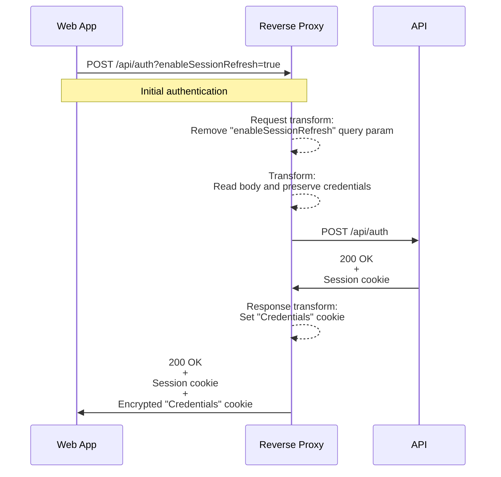
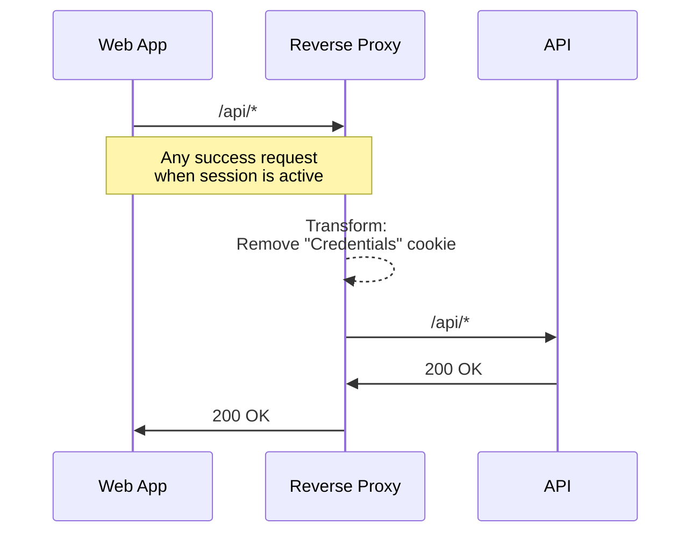
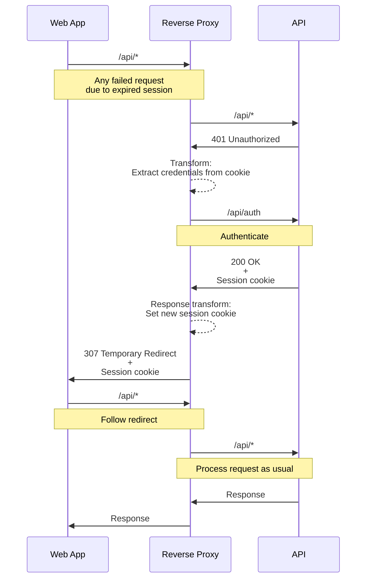
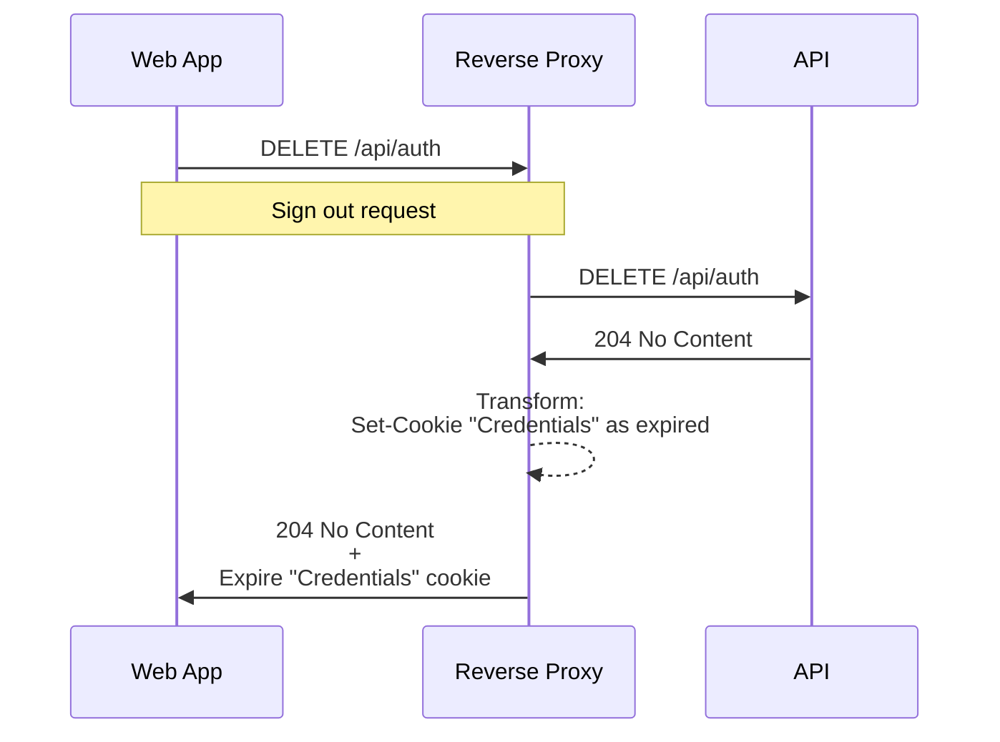

*[YARP]: YARP (Yet Another Reverse Proxy) is an open-source reverse proxy toolkit designed for . NET applications.

## Story

I was working on a project where I was creating a separate web application for an existing backend service. Since I had no way to modify the existing backend, I routed all requests through the YARP reverse proxy. With the reverse proxy in the middle of the request chain, I could easily add new features to my web application without touching the original backend. While creating new API endpoints for new features is straightforward because YARP uses .NET and the infrastructure of ASP.NET, there was one thing I had to deal with.

The idea was to keep the user signed in to the application, but the problem was that the existing backend service did not provide such a capability like a token refresh mechanism. Instead, it just issued a session cookie that was valid for a certain amount of time.

## Requirements

Implement an automatic session refresh mechanism to keep users logged in to the application without having to enter credentials and manually log in again too often.

## Solution

Stack used:
- C#, ASP.NET, YARP.

I can think of two possible approaches to solve the problem. One is to handle the `401 Unauthorized` response from the frontend, the other from the backend. However, the main question here is where to store the user's credentials to be able to reuse them to authenticate the user on his behalf, since there are no other mechanisms available to authenticate the user. As far as the browser is concerned, there is only one place that might be suitable for storing sensitive data - cookies. Cookies could be marked as secure to prevent XSS attacks. However, it is still not a good idea to store user credentials in plain text in cookies.

I decided to handle `401 Unauthorized` response from backend while storing user credentials in cookies. To protect user credentials from unauthorized access, I have encrypted them with a key known only to the backend system. So even if someone manages to get access to the cookies, they will not be able to use them to authenticate the user in other systems.

### Approach

So here is the general idea of the solution:

- When the user logs in, the reverse proxy forwards the request to the API and returns the "credentials" cookie along with the API response. This is the first transformation I need to implement.
- When the user sends any request to the API, the reverse proxy forwards the request to the API, and if the API returns `401 Unauthorized`, then the reverse proxy uses the "credentials" cookie to authenticate the user. Then I need to update the original session cookie on the client side and ask the client to retry the request to succeed this time. This should be handled by the browser itself. This is the second transformation.
- When the user logs out, the reverse proxy forwards the request to the API and also removes the "credentials" cookie on the client. This is the third transformation.
- For the sake of completeness, I need to implement the fourth transformation to remove the credential cookie before passing the request to the API because it does not belong to the API.
- When the user submits an authentication request, there is a query parameter that enables the session refresh mechanism. This query parameter should be removed by the transformation.

To get a better idea of the flows, here are sequence diagrams of the solution:

#### Initial authentication



#### Handle requests when session is active



#### Handle requests when session is expired



#### Handle sign out request



### Implementation

#### Encryption service

I use the ASP.NET Core Data Protection API to encrypt and decrypt the credentials. It allows to avoid using predefined passwords or keys for encryption and decryption. Instead, it uses a key that is automatically generated and stored on the server.

```csharp
using Microsoft.AspNetCore.DataProtection;

internal class EncryptionService(IDataProtectionProvider dataProtectionProvider)
{
  private readonly IDataProtector _protector =
    dataProtectionProvider.CreateProtector("Credentials");

  public string Encrypt(string cookieValue)
  {
    return _protector.Protect(cookieValue);
  }

  public string Decrypt(string protectedCookieValue)
  {
    return _protector.Unprotect(protectedCookieValue);
  }
}
```
{: file="EncryptionService.cs" }

#### API service

I need a service that will talk to API to issue session cookie when user's session expires on his behalf. Below I use `HttpClient` to make requests to API. All it needs is to provide credentials to API endpoint and get cookies from response including session cookie. This is because I want to preserve all possible cookies from the API response so as not to interfere with the original authentication flow.

```csharp
using Configuration;

internal class OriginalApiService(
  HttpClient httpClient,
  IOptions<EnableSessionRefreshOptions> options)
  : IOriginalApiService
{
  private const string SetCookieHeader = "Set-Cookie";

  private readonly string _originalServiceBaseAddress =
    options.Value.Authentication.BaseAddress;
  private readonly string _authApiEndpoint =
    options.Value.Authentication.Endpoint;

  public async Task<IDictionary<string, string>> SignInAndGetSessionCookies(
    string username,
    string password)
  {
    var payload = JsonContent.Create(new
    {
      username,
      password
    });

    httpClient.BaseAddress = new Uri(_originalServiceBaseAddress);

    var response = await httpClient.PostAsync(_authApiEndpoint, payload);
    if (!response.IsSuccessStatusCode ||
      !response.Headers.TryGetValues(SetCookieHeader, out var cookies))
      return new Dictionary<string, string>();

    return cookies.Select(cookie =>
    {
      var parts = cookie.Split('=');
      var cookieName = parts[0];
      var cookieValue = parts[1].Split(';')[0];
      return new KeyValuePair<string, string>(cookieName, cookieValue);
    }).ToDictionary(x => x.Key, x => x.Value);
  }
}
```
{: file="OriginalApiService.cs" }

#### Transformation #1: Read and preserve credentials

The first step is to read the credentials from the authentication request and store them in the request's `HttpContext`. This is necessary to preserve the credentials for future use. The logic is executed only if requested by the user, e.g. the appropriate checkbox is checked, so the web application sends the request parameter `enableSessionRefresh=true`. Then, if the authentication request is successful, the credentials are encrypted and set as a cookie to be stored in the browser on the client side. This way, I can have the user's credentials available for any future request.

```csharp
using System.Text;
using System.Text.Json;
using Configuration;
using Models;
using Services;

internal class SignInTransform : ITransformProvider
{
  private const string SetCredentialsKey = "SetCredentials";

  private readonly string _authApiEndpoint;
  private readonly string _enableSessionRefreshKeyName;
  private readonly string _credentialsCookieName;
  private readonly int _persistCredentialsMaxDays;

  private readonly JsonSerializerOptions _jsonSerializerOptions = new()
  {
    PropertyNameCaseInsensitive = true
  };

  public SignInTransform(IOptions<EnableSessionRefreshOptions> options)
  {
    var settings = options.Value;
    _authApiEndpoint = settings.Authentication.Endpoint;
    _enableSessionRefreshKeyName = settings.QueryParamName;
    _credentialsCookieName = settings.CredentialsCookieName;
    _persistCredentialsMaxDays = settings.PersistCredentialsMaxDays;
  }

  public void ValidateRoute(TransformRouteValidationContext context)
  {
  }

  public void ValidateCluster(TransformClusterValidationContext context)
  {
  }

  public void Apply(TransformBuilderContext transformBuilderContext)
  {
    transformBuilderContext.AddRequestTransform(async context =>
    {
      if (context.HttpContext.Request.Path != _authApiEndpoint ||
        context.HttpContext.Request.Method != "POST")
        return;

      if (!context.HttpContext.Request.Query.TryGetValue(_enableSessionRefreshKeyName,
        out var enableSessionRefreshValue) ||
        !bool.TryParse(enableSessionRefreshValue,
        out var enableSessionRefresh) || !enableSessionRefresh)
        return;

      context.HttpContext.Request.EnableBuffering();
      var buffer =
        new byte[Convert.ToInt32(context.HttpContext.Request.ContentLength)];
      _ = await context.HttpContext.Request.Body.ReadAsync(buffer);
      var body = Encoding.UTF8.GetString(buffer);
      context.HttpContext.Request.Body.Position = 0;
      context.HttpContext.Request.QueryString = QueryString.Empty;

      try
      {
        var credentials =
          JsonSerializer.Deserialize<Credentials>(body, _jsonSerializerOptions);
        if (credentials != null)
        {
          context.HttpContext.Items[SetCredentialsKey] =
            $"{credentials.User}|{credentials.Password}";
        }
      }
      catch
      {
        // ignored
      }
    });

    transformBuilderContext.AddResponseTransform(context =>
    {
      if (context.HttpContext.Request.Path != _authApiEndpoint ||
        context.HttpContext.Request.Method != HttpMethod.Post.ToString() ||
        context.HttpContext.Response.StatusCode != (int)HttpStatusCode.NoContent)
        return default;

      if (!context.HttpContext.Items.TryGetValue(SetCredentialsKey, out var credentials) ||
        credentials == null)
        return default;

      var encryptionService =
        transformBuilderContext.Services.GetService<EncryptionService>()!;
      var encryptedCredentials = encryptionService.Encrypt(credentials.ToString()!);
      context.HttpContext.Response.Cookies.Append(
        _credentialsCookieName,
        encryptedCredentials,
        new CookieOptions
        {
          Secure = true,
          HttpOnly = true,
          MaxAge = TimeSpan.FromDays(_persistCredentialsMaxDays)
        });

      return default;
    });
  }
}
```
{: file="SignInTransform.cs" }

#### Transformation #2: Remove cookie

The second transformation is to remove the credentials cookie from requests. Since this cookie is only related to my reverse proxy feature, I don't want to send it to the original API.

```csharp
using Configuration;
using Microsoft.Extensions.Primitives;
using Microsoft.Net.Http.Headers;
using Cookies = (string?[]? cookiesExceptCredentials, string? credentialsCookie);

internal class RemoveCookieTransform : ITransformProvider
{
  private const string CookieHeader = "Cookie";

  private readonly string _credentialsCookieName;

  public RemoveCookieTransform(IOptions<EnableSessionRefreshOptions> options)
  {
    var settings = options.Value;
    _credentialsCookieName = settings.CredentialsCookieName;
  }

  public void ValidateRoute(TransformRouteValidationContext context)
  {
  }

  public void ValidateCluster(TransformClusterValidationContext context)
  {
  }

  public void Apply(TransformBuilderContext transformBuilderContext)
  {
    transformBuilderContext.AddRequestTransform(context =>
    {
      var headers = context.HttpContext.Request.Headers;
      if (!TryExtractCookies(headers, out var cookies))
        return default;

      headers.Remove(CookieHeader);
      headers.Append(CookieHeader, cookies.cookiesExceptCredentials);

      context.HttpContext.Items[_credentialsCookieName] = cookies.credentialsCookie;

      return default;
    });
  }

  private bool TryExtractCookies(IHeaderDictionary headers, out Cookies cookies)
  {
    cookies = new Cookies(null, null);

    if (!headers.TryGetValue(CookieHeader, out var existingValues))
      return false;

    if (existingValues.Count == 0)
      return false;

    var parsedCookies = CookieHeaderValue.ParseList(existingValues.ToList()!);
    var credentials =
      parsedCookies.FirstOrDefault(x => x.Name == _credentialsCookieName)?.Value.Value;
    var allOthersExceptCredentials =
      new StringValues(parsedCookies
      .Where(x => x.Name != _credentialsCookieName)
      .Select(x => x.ToString()).ToArray());

    cookies = new Cookies(allOthersExceptCredentials, credentials);
    return true;
  }
}
```
{: file="RemoveCookieTransform.cs" }

#### Transformation #3: Refresh session

This is where the refresh session logic is implemented. Whenever a request is made to the API and the response is `401 Unauthorized`, if the user has the refresh feature enabled and so the credentials are set in cookies, then a refresh session is triggered. I decrypt the credentials from the cookie and call the authentication API to get a new session cookie. The original response that caused the `401 Unauthorized` is completely removed and replaced with the new response that contains the new session cookie and prompts the client to retry the request. Because the session cookie contains a valid session value, the request will be successful this time.

```csharp
using Configuration;
using Services;

internal class RefreshSessionTransform : ITransformProvider
{
  private readonly string _credentialsCookieName;
  private readonly string _authApiEndpoint;

  public RefreshSessionTransform(IOptions<EnableSessionRefreshOptions> options)
  {
    var settings = options.Value;
    _credentialsCookieName = settings.CredentialsCookieName;
    _authApiEndpoint = settings.Authentication.Endpoint;
  }

  public void ValidateRoute(TransformRouteValidationContext context)
  {
  }

  public void ValidateCluster(TransformClusterValidationContext context)
  {
  }

  public void Apply(TransformBuilderContext transformBuilderContext)
  {
    var originalServiceService =
      transformBuilderContext.Services.GetService<IOriginalApiService>()!;

    transformBuilderContext.AddResponseTransform(async context =>
    {
      if (context.HttpContext.Response.StatusCode != (int)HttpStatusCode.Unauthorized ||
        context.HttpContext.Request.Path == _authApiEndpoint)
        return;

      var credentialItems = context.HttpContext.Items[_credentialsCookieName];
      if (credentialItems == null)
        return;

      var encryptionService =
        transformBuilderContext.Services.GetService<EncryptionService>()!;
      var unencryptedCredentials = encryptionService.Decrypt(credentialItems.ToString()!);
      var credentials = Uri.UnescapeDataString(unencryptedCredentials);
      var separatorIndex = credentials.IndexOf('|');

      if (separatorIndex < 0)
        return;

      var username = credentials.Substring(0, separatorIndex);
      var password =
        credentials.Substring(separatorIndex + 1, credentials.Length - separatorIndex - 1);

      var cookies =
        await originalServiceService.SignInAndGetSessionCookies(username, password);
      if (cookies.Count == 0)
        return;

      context.HttpContext.Response.Clear();

      foreach (var cookie in cookies)
      {
        context.HttpContext.Response.Cookies.Append(
          cookie.Key,
          cookie.Value,
          new CookieOptions
          {
            Secure = true,
            HttpOnly = true
          });
      }

      context.HttpContext.Response.Redirect(context.HttpContext.Request.Path, false, true);
    });
  }
}
```
{: file="RefreshSessionTransform.cs" }

#### Transformation #4: Sign out

When the user signs out, we need to remove the credentials cookie from the client's browser.

```csharp
using Configuration;

internal class SignOutTransform : ITransformProvider
{
  private readonly string _authApiEndpoint;
  private readonly string _credentialsCookieName;

  public SignOutTransform(IOptions<EnableSessionRefreshOptions> options)
  {
    var settings = options.Value;
    _authApiEndpoint = settings.Authentication.Endpoint;
    _credentialsCookieName = settings.CredentialsCookieName;
  }

  public void ValidateRoute(TransformRouteValidationContext context)
  {
  }

  public void ValidateCluster(TransformClusterValidationContext context)
  {
  }

  public void Apply(TransformBuilderContext transformBuilderContext)
  {
    transformBuilderContext.AddResponseTransform(context =>
    {
      if (context.HttpContext.Request.Path != _authApiEndpoint ||
        context.HttpContext.Request.Method != HttpMethod.Delete.ToString() ||
        context.HttpContext.Response.StatusCode != (int)HttpStatusCode.NoContent)
        return default;

      context.HttpContext.Response.Cookies.Append(_credentialsCookieName, string.Empty,
        new CookieOptions
        {
          Secure = true,
          MaxAge = TimeSpan.Zero
        });

      return default;
    });
  }
}
```
{: file=SignOutTransform.cs}

#### Put it all together

Put it all together in the `Program.cs` file: enable reverse proxy and register transformations.

```csharp
using MyApp.Api.Configuration;
using MyApp.Api.Services;
using MyApp.Api.Transforms;
using MyApp.Api.Extensions;

var builder = WebApplication.CreateBuilder(args);

var sessionRefreshConfiguration = builder.Configuration.GetSection("EnableSessionRefreshSettings");
var sessionRefreshOptions = keepMeSignedInConfiguration.Get<EnableSessionRefreshOptions>();

builder.Services
  .Configure<EnableSessionRefreshOptions>(sessionRefreshConfiguration)
	.ConfigureDataProtection(sessionRefreshOptions)
  .AddSingleton<EncryptionService>()
  .AddReverseProxy()
  .LoadFromConfig(builder.Configuration.GetSection("ReverseProxy"))
  .AddTransforms<SignInTransform>()
  .AddTransforms<RemoveCookieTransform>()
  .AddTransforms<SignOutTransform>()
  .AddTransforms<RefreshSessionTransform>();

builder.Services
  .AddHttpClient<IOriginalApiService, OriginalApiService>();

var app = builder.Build();

app.MapReverseProxy();
app.UseStatusCodePagesWithReExecute("/");
app.UseFileServer();
app.Run();
```
{: file="Program.cs"}

Some configuration pieces are extracted into the `appsettings.json` file like API endpoint to authenticate, cookie name, and so on.

```json
"EnableSessionRefreshSettings": {
  "QueryParamName": "enableSessionRefresh",
  "CredentialsCookieName": "Credentials",
  "PersistCredentialsMaxDays": 90,
	"ProtectionKeyStoragePath": "/etc/myapp",
  "Authentication": {
    "BaseAddress": "https://original-service.com/",
    "Endpoint": "/api/auth"
  }
}
```
{: file="appsettings.json"}

Here is an extension method to configure data protection based on the settings above.

```cs
using Configuration;
using Microsoft.AspNetCore.DataProtection;

internal static class DataProtection
{
   private const string DotNetRunningInContainer = "DOTNET_RUNNING_IN_CONTAINER";

   public static IServiceCollection ConfigureDataProtection(
    this IServiceCollection services,
    KeepMeSignedInOptions? options)
   {
     if (options == null)
     {
        return services;
     }

     var isRunningInContainer =
        bool.TryParse(Environment.GetEnvironmentVariable(DotNetRunningInContainer),
         out var value) && value;

     if (isRunningInContainer)
     {
        services.AddDataProtection()
           .SetApplicationName("MyApp")
           .SetDefaultKeyLifetime(TimeSpan.FromDays(options.PersistCredentialsMaxDays))
           .PersistKeysToFileSystem(new DirectoryInfo(options.ProtectionKeyStoragePath));
     }

     return services;
   }
}
```
{: file="Extensions/DataProtection.cs"}

Now I can launch the application and have fun with the application without being asked to sign in too often.

## Conclusion

The proposed solution works as expected, but there are pros and cons. Also, key retention policies, key encryption, and key storage are not described much here. If someone tries to reuse the solution, it may need to be reviewed and adjusted a little.

Pros:
- No central storage of credentials on proxy side.
- Clients keep their credentials safe.
- No predefined master key. New encryption key generated for each reverse proxy instance.

Cons:
- The encryption key had to be kept on the backend to be able to decrypt credentials stored in user cookies after a reverse proxy restart or in case of multiple instances running e.g. in Kubernetes.
- The data protection API is not primary intended for indefinite persistence of confidential payloads according to documentation. Even though there are more suitable storages available like cloud management storages, ASP.NET Core data protection API can be used for long-term protection of confidential data. The developer can choose which encryption algorithm to use.
