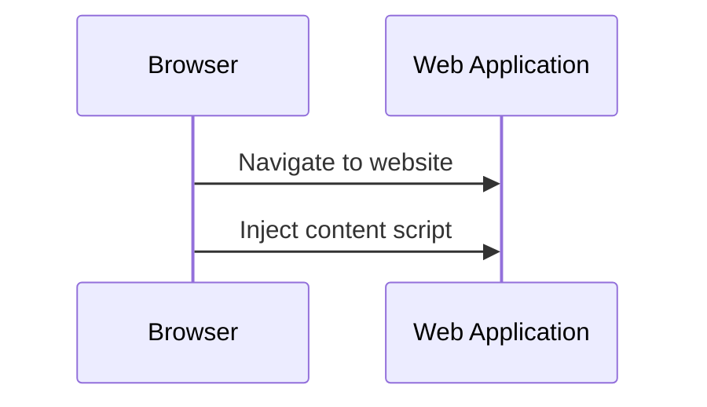

## Story
Typically, agile teams do not practice writing formal requirements. Instead, they use stories to describe what needs to be done, and the QA team can use test cases to fix expected behavior for future use in regression, for example. In such a scenario, test cases become very important, and test management systems are what people use every day to create, track, and execute test cases.

In one such routine, the project I was working on decided to switch to a new test management system. It is an online web platform where you interact with the software using a regular web browser. However, as it turned out, this system lacked some functionality and not every single aspect of UX was adopted for everyday use.

The main thing that was missing is that it makes the test case review process difficult. There is no way to clearly see the history of changes. The history records do exist, but they contain not only the changed test case steps, but the entire test case data, which makes reviewing a very difficult task.

The other thing is that the application is not designed to be used from the keyboard. People who do the same thing many times want to perform routine actions faster. That is why keyboard support is very important in professional software.

Since I have no control over the product, I have tried to solve or work around these problems. Since this product is a web application, there is a chance of success.

## Requirements
- Improve the test case review process by making it easier to review changes
- Improve user experience by handling keystrokes from the keyboard

## Solution
The application runs inside the browser. Every modern browser offers the ability to inject custom scripts using browser extensions. They allow you to create standalone applications, application companions, and extensions to existing applications. The Chrome and Firefox browsers offer a variety of options such as content scripts, background scripts, and a number of UI controls and elements that can be used by extensions.

Since we don't have control over the application, it's not possible to make big changes that would require a lot of support and might break easily. Therefore, the intent is to find the simplest way to achieve our goals.

Basically, the idea is to inject custom logic into the existing application by adding custom scripts that are loaded and executed on demand. Such a script is called a `content` script in web browser parlance.



So I can run any custom script I want. However, I want my script to be executed when certain actions occur, such as highlight changes in the test case history only when the user observes them. The solution may vary depending on the web application implementation itself, as there may be different solutions applicable.

In my case, I had to deal with dynamic content, so I decided to inject my custom script each time the user accesses the web application. The content script then registers all the feature implementations and waits for conditions to occur that should trigger the execution of a particular feature. Consider the following feature example.

```js
// Conditions when this feature should apply
// Namely when specific tag appears in DOM
const trigger = {
  mutationType: 'childList',
  tagName: 'teststep-history-modal'
};

// Function to call to execute this feature
async function exec() {
  const historyDialogTitle = await getHistoryDialogTitle();
  if (!historyDialogTitle) {
    return;
  }

  highlightChangedRows(historyDialogTitle);
}
```

There are a number of features with their own trigger conditions and functions. The `content` script, in turn, monitors the state of the web application and checks feature triggers to decide when to call feature functions.

```js
// All features will be registered here
const subscribers = [];

// Monitor web application state/changes
const onDomChangeCallback = (mutations, observer) => {
  for (const mutation of mutations) {
    if (mutation.type === 'childList') {
      const addedNodes = mutation.addedNodes;

      if (!addedNodes.length) {
        return;
      }

      // Check if any feature should be triggered
      addedNodes.forEach(node => {
        subscribers.filter(subscriber => subscriber.trigger.mutationType === 'childList').forEach(subscriber => {
          const trigger = subscriber.trigger;

          const isTagNameMatched = !trigger.tagName || trigger.tagName === node.localName;
          const isIdMatched = !trigger.id || trigger.id === node.id;

          if (isTagNameMatched && isIdMatched) {
            // Call feature to execute
            subscriber.exec(node.baseURI);
          }
        });
      });
    }
  }
}

// Inject content script once only
function main() {
  if (window.hasRun) {
    return;
  }
  window.hasRun = true;

  // Register custom features
  subscribers.push({ trigger: highlightHistoryTrigger, exec: highlightHistoryExec });
  subscribers.push({ trigger: scrollHistoryTrigger, exec: scrollHistoryExec });
  subscribers.push({ trigger: copyNumberTrigger, exec: copyNumberExec });

  // Execute the feature that has no conditions right away
  dismissDialogExec();

  const config = { childList: true, subtree: true };
  const observer = new MutationObserver(onDomChangeCallback);
  observer.observe(document.body, config);
}
```

This may seem like a lot of work, and it is. However, in this particular case, there was no way to rely on the web application URL or other properties to determine the state of the web application. In fact, due to the early filtering of the mutation type, only a few changes are checked.

In the end, this solution[^SourceCode] worked well and could be manually installed in the browser. However, it is not a convenient solution for distribution across teams.

## Distribution
Each browser company maintains its own extension store where extension developers should submit their extensions and pass some validations and checks to publish extensions to the store. For some stores this is completely free, for others it costs some money. In addition, extensions may require separate preparation for each browser, as well as separate data and image sets to be used for the extension's store page. All this takes time for the first release of an extension. However, once this is done and the extension has passed the review process, which can take a considerable amount of time, end users can finally install the extension in the usual way by navigating to the extension's page in the web browser's store. Another advantage of distributing through the store is that the next time you release a new version, the extension will automatically be updated on users' machines, making the update distribution process flawless.

## Conclusion
- Browser extensions are a nice feature of web browsers that people can use to build a variety of applications to meet their needs.
- There is good documentation out there for extension developers, which means that companies would love for people to build extensions.
- Hopefully, I have been able to work around the limitations and imperfections of the test case management web application. While it has been fun, it would be really nice if the management, developers and testers of the original application would think about how their product is being used and make it just a little bit better, I would never have to spend time doing all this. This is a good lesson and reminder for all of us.

## Demo

_Feature: Highlight changes_


_Feature: Copy link and details_

{: .text-center }
[](https://addons.mozilla.org/en-US/firefox/addon/assistant-for-qtest-manager/)
[](https://chrome.google.com/webstore/detail/pnbnfgjbennnjlajgpoajfilinkdpiaf)

## References
[^SourceCode]: [Source code](https://github.com/kungfux/qtest-manager-assistant)
